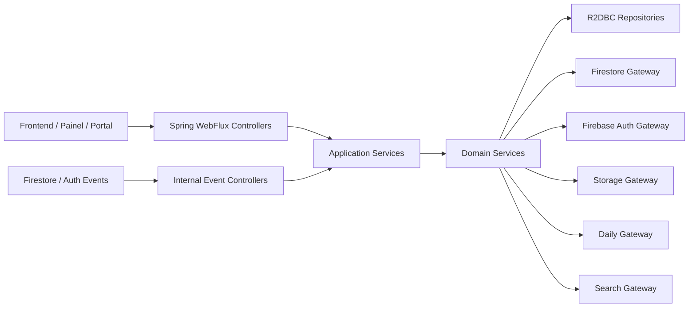
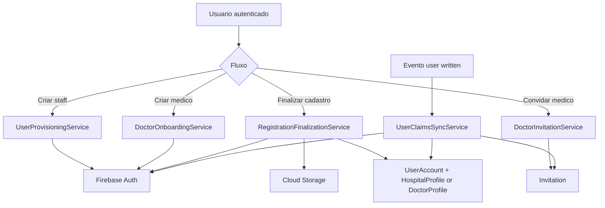
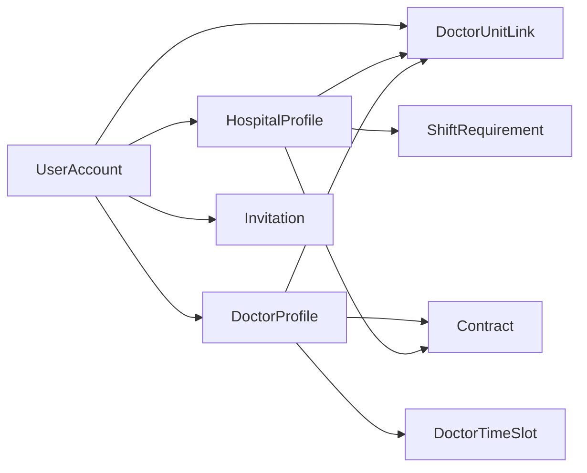
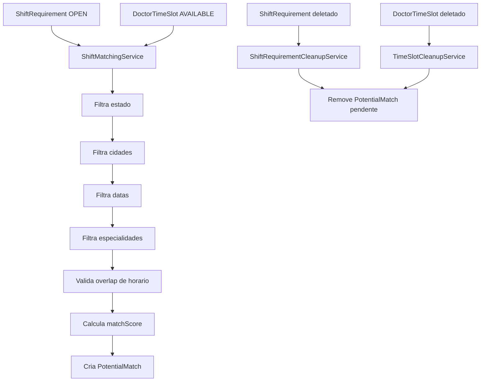
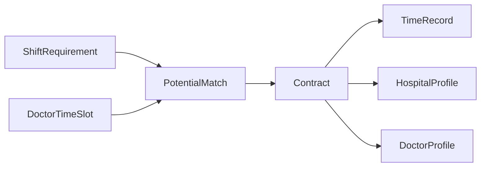
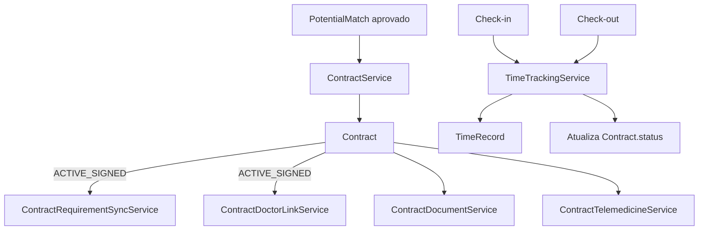
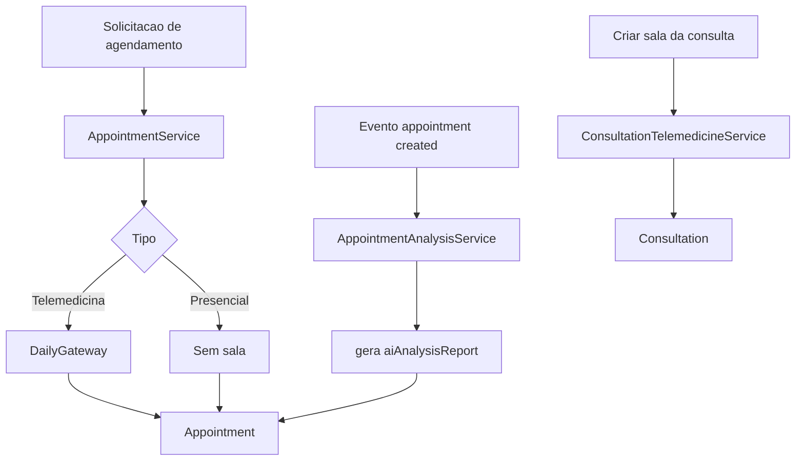
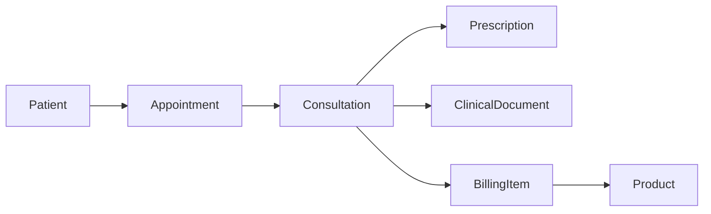
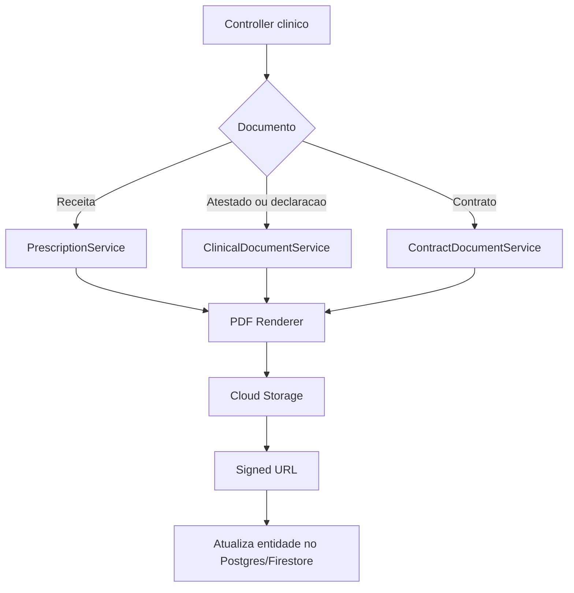

# Backend Java com Stack Atual

Este documento mapeia a migracao completa do `functions/src/logic.ts` para o backend Java em `apps/server`, preservando a stack e a infraestrutura ja configuradas no projeto.

## Base Tecnica

Stack atual do `server`:

- Java 21
- Spring Boot 3.5
- Spring WebFlux
- Spring Security OAuth2 Client + Resource Server
- JHipster 8
- R2DBC + PostgreSQL
- Elasticsearch
- Actuator + Prometheus
- OpenAPI via `springdoc`
- Docker Compose local

Infra que precisa ser mantida para a migracao do dominio:

- Firebase Auth
- Firestore
- Cloud Storage
- Daily API
- Secrets por ambiente
- eventos equivalentes aos gatilhos atuais do Firestore/Auth

Conclusao arquitetural:

- o `server` vira o backend principal de negocio;
- os handlers `onCall` viram endpoints REST;
- os gatilhos `onDocumentCreated`, `onDocumentWritten`, `onDocumentDeleted` e `auth.user().onDelete` viram consumidores de eventos internos;
- Postgres guarda o dominio transacional principal;
- Firestore e Storage continuam como infraestrutura de interoperabilidade, documentos operacionais e compatibilidade com o legado.

## Principios de Projeto

1. O dominio deve sair de handlers monoliticos e entrar em servicos Java coesos.
2. O modelo de dados precisa ser explicito; hoje o TypeScript usa documentos sem fronteira forte.
3. Firestore nao deve continuar como unica fonte de verdade para agregados centrais.
4. Eventos precisam ser idempotentes; boa parte dos handlers atuais nao e.
5. Claims, perfis e aprovacoes precisam ter um fluxo unico de seguranca.

## Visao de Camadas



## Estrutura de Pacotes Proposta

```text
com.tws.company
  config
  security
  shared
  firebase
    auth
    firestore
    storage
    event
  user
    domain
    service
    repository
    web
  hospital
    domain
    service
    repository
    web
  doctor
    domain
    service
    repository
    web
  invitation
  scheduling
  contract
  appointment
  consultation
  document
  billing
  timerecord
  analysis
  maintenance
  integration
    daily
```

## Mapeamento Completo dos Handlers

### Users e Autenticacao

| Handler TS | Controller Java | Service Java | Observacao |
| --- | --- | --- | --- |
| `createStaffUserHandler` | `/api/users/staff` | `UserProvisioningService` | cria usuario no Firebase Auth e perfil interno |
| `createDoctorUserHandler` | `/api/users/doctors` | `DoctorOnboardingService` | cria medico pendente |
| `resetDoctorUserPasswordHandler` | `/api/users/doctors/{id}/reset-password` | `DoctorCredentialService` | hospital so reseta medico vinculado |
| `finalizeRegistrationHandler` | `/api/registrations/finalize` | `RegistrationFinalizationService` | move arquivos, seta claims, salva perfil |
| `onUserWrittenSetClaimsHandler` | `/api/internal/events/users-written` | `UserClaimsSyncService` | sincroniza claims e convite |
| `confirmUserSetupHandler` | `/api/users/me/confirm-setup` | `UserSetupService` | ativa usuario convidado |
| `associateDoctorToUnitHandler` | `/api/hospitals/{id}/doctors/{doctorId}` | `DoctorAssociationService` | vinculo hospital-medico |
| `searchAssociatedDoctorsHandler` | `/api/hospitals/me/doctors/search` | `DoctorSearchService` | busca por nome/CRM/email |
| `sendDoctorInvitationHandler` | `/api/hospitals/me/doctor-invitations` | `DoctorInvitationService` | gera token e convite |
| `approveDoctorHandler` | `/api/admin/doctors/{id}/approve` | `DoctorApprovalService` | aprovacao administrativa |
| `setAdminClaimHandler` | `/api/admin/users/set-admin` | `RoleAdministrationService` | elevacao administrativa |
| `setHospitalManagerRoleHandler` | `/api/admin/users/set-hospital-role` | `RoleAdministrationService` | claim hospital |
| `resetStaffUserPasswordHandler` | `/api/users/staff/{id}/reset-password` | `StaffCredentialService` | admin/hospital |
| `onUserDeletedCleanupHandler` | `/api/internal/events/auth-user-deleted` | `UserLifecycleCleanupService` | limpeza em cascata |

### Scheduling, Matching e Plantao

| Handler TS | Controller Java | Service Java | Observacao |
| --- | --- | --- | --- |
| `findMatchesOnShiftRequirementWriteHandler` | `/api/internal/events/shift-requirement-written` | `ShiftMatchingService` | recalcula matches |
| `onShiftRequirementDeleteHandler` | `/api/internal/events/shift-requirement-deleted` | `ShiftRequirementCleanupService` | remove matches pendentes |
| `onTimeSlotDeleteHandler` | `/api/internal/events/time-slot-deleted` | `TimeSlotCleanupService` | remove matches pendentes |
| `createAppointmentHandler` | `/api/appointments` | `AppointmentService` | cria agendamento e sala Daily quando telemedicina |
| `getAvailableSlotsForSpecialtyHandler` | `/api/appointments/available-slots` | `AvailabilityQueryService` | disponibilidade telemedicina |
| `findAvailableDoctorHandler` | `/api/appointments/available-doctor` | `DoctorAvailabilityService` | busca rapida por especialidade |

### Contratos, Operacoes e Financeiro

| Handler TS | Controller Java | Service Java | Observacao |
| --- | --- | --- | --- |
| `generateContractPdfHandler` | `/api/contracts/{id}/pdf` | `ContractDocumentService` | gera contrato em PDF |
| `createTelemedicineRoomHandler` | `/api/contracts/{id}/telemedicine-room` | `ContractTelemedicineService` | integra Daily |
| `onContractFinalizedUpdateRequirementHandler` | `/api/internal/events/contract-written/requirement-sync` | `ContractRequirementSyncService` | fecha demanda |
| `onContractFinalizedLinkDoctorHandler` | `/api/internal/events/contract-written/doctor-link` | `ContractDoctorLinkService` | vinculo automatico medico-unidade |
| `registerTimeRecordHandler` | `/api/contracts/{id}/check-in` | `TimeTrackingService` | check-in com foto e geoponto |
| `registerCheckoutHandler` | `/api/contracts/{id}/check-out` | `TimeTrackingService` | check-out |
| `recordBillingItemHandler` | `/api/consultations/{id}/billing-items` | `BillingService` | item e custo de material |

### Documentos Clinicos

| Handler TS | Controller Java | Service Java | Observacao |
| --- | --- | --- | --- |
| `generatePrescriptionPdfHandler` | `/api/consultations/{id}/prescriptions` | `PrescriptionService` | gera receita |
| `generateDocumentPdfHandler` | `/api/consultations/{id}/documents` | `ClinicalDocumentService` | atestado/declaracao |
| `createConsultationRoomHandler` | `/api/consultations/{id}/telemedicine-room` | `ConsultationTelemedicineService` | integra Daily |

### Scripts e Migracoes

| Handler TS | Controller Java | Service Java | Observacao |
| --- | --- | --- | --- |
| `correctServiceTypeCapitalizationHandler` | `/api/scripts/service-type/correct` | `MaintenanceScriptService` | normalizacao de dados |
| `migrateDoctorProfilesToUsersHandler` | `/api/scripts/migrate-doctor-profiles` | `DoctorProfileMigrationService` | legado -> users |
| `migrateHospitalProfileToV2Handler` | `/api/scripts/migrate-hospital-profile` | `HospitalProfileMigrationService` | flatten -> `companyInfo` |

### IA

| Handler TS | Controller Java | Service Java | Observacao |
| --- | --- | --- | --- |
| `onAppointmentCreated_RunAIAnalysis` | `/api/internal/events/appointment-created` | `AppointmentAnalysisService` | pre-analise por IA |

## Strategia de Persistencia

O dominio em Java deve adotar persistencia hibrida, mas com dono claro por agregado.

### Postgres como fonte principal

- `users`
- `hospitals`
- `doctors`
- `doctor_unit_links`
- `invitations`
- `patients`
- `appointments`
- `consultations`
- `shift_requirements`
- `doctor_time_slots`
- `potential_matches`
- `contracts`
- `time_records`
- `billing_items`
- `prescriptions`
- `clinical_documents`
- `products`

### Firestore como suporte de interoperabilidade

- espelhamento seletivo para telas legadas
- ingestao de eventos externos
- armazenamento de payloads operacionais
- compatibilidade durante a migracao gradual

### Cloud Storage

- documentos de cadastro
- PDFs
- fotos de check-in/check-out

### Elasticsearch

- busca textual de medicos, pacientes, hospitais e contratos

## Entidades de Dominio Alvo

### `UserAccount`

Responsavel por identidade aplicacional e associacao com auth externo.

Campos principais:

- `id`
- `externalAuthUid`
- `email`
- `displayName`
- `displayNameLowercase`
- `userType`
- `status`
- `documentVerificationStatus`
- `activated`
- `createdAt`
- `updatedAt`

### `HospitalProfile`

- `userId`
- `companyName`
- `companyInfo.cnpj`
- `companyInfo.stateRegistration`
- `companyInfo.phone`
- `companyInfo.address`
- `legalRepresentativeInfo`

### `DoctorProfile`

- `userId`
- `professionalCrm`
- `specialties`
- `desiredHourlyRate`
- `status`
- `healthUnitIds`

### `Invitation`

- `id`
- `hospitalId`
- `doctorEmail`
- `token`
- `status`
- `createdAt`

### `Patient`

- `id`
- `cpf`
- `name`
- `dob`
- `phone`
- `email`

### `ShiftRequirement`

- `id`
- `hospitalId`
- `hospitalName`
- `dates`
- `startTime`
- `endTime`
- `isOvernight`
- `serviceType`
- `specialtiesRequired`
- `offeredRate`
- `numberOfVacancies`
- `status`
- `cities`
- `state`

### `DoctorTimeSlot`

- `id`
- `doctorId`
- `doctorName`
- `date`
- `startTime`
- `endTime`
- `isOvernight`
- `serviceType`
- `specialties`
- `desiredHourlyRate`
- `cities`
- `state`
- `status`

### `PotentialMatch`

- `id`
- `shiftRequirementId`
- `timeSlotId`
- `doctorId`
- `hospitalId`
- `matchedDate`
- `matchScore`
- `status`
- `offeredRateByHospital`
- `doctorDesiredRate`

### `Contract`

- `id`
- `shiftRequirementId`
- `doctorId`
- `hospitalId`
- `doctorName`
- `hospitalName`
- `specialties`
- `shiftDates`
- `startTime`
- `endTime`
- `doctorRate`
- `serviceType`
- `status`
- `contractPdfUrl`
- `telemedicineLink`

### `Appointment`

- `id`
- `patientId`
- `patientName`
- `doctorId`
- `doctorName`
- `specialty`
- `type`
- `appointmentDate`
- `status`
- `telemedicineRoomUrl`
- `aiAnalysisReport`
- `createdBy`

### `Consultation`

- `id`
- `appointmentId`
- `patientId`
- `doctorId`
- `telemedicineLink`
- `prescriptionIds`
- `documentIds`
- `totalMaterialCost`

### `Prescription`

- `id`
- `consultationId`
- `patientName`
- `doctorName`
- `doctorCrm`
- `medications`
- `pdfUrl`

### `ClinicalDocument`

- `id`
- `consultationId`
- `type`
- `patientName`
- `doctorName`
- `doctorCrm`
- `details`
- `pdfUrl`

### `TimeRecord`

- `id`
- `contractId`
- `doctorId`
- `hospitalId`
- `checkInTime`
- `checkInLocation`
- `checkInPhotoUrl`
- `checkOutTime`
- `checkOutLocation`
- `checkOutPhotoUrl`
- `status`

### `BillingItem`

- `id`
- `consultationId`
- `productId`
- `productName`
- `quantityUsed`
- `unitCostAtTime`
- `totalCost`
- `recordedByUid`

## Fluxograma do Dominio de Identidade e Cadastro



## Fluxograma das Entidades de Usuarios



## Fluxograma de Matching de Plantoes



## Fluxograma das Entidades de Escala



## Fluxograma de Contrato e Operacao



## Fluxograma de Consulta, Agenda e IA



## Fluxograma das Entidades Clinicas



## Fluxograma de Documentos e Storage



## Modelo de Seguranca

O TypeScript atual depende de `request.auth.token.role` e `custom claims` do Firebase. No Java, o modelo recomendado e:

1. autenticar via mecanismo padrao do `server`;
2. mapear claim de role para `GrantedAuthority`;
3. manter em banco o perfil de negocio (`UserAccount`, `DoctorProfile`, `HospitalProfile`);
4. usar `Firebase Admin SDK` apenas para:
   - provisionar usuarios;
   - sincronizar claims quando exigido pelo legado;
   - consumir eventos de lifecycle.

Se for necessario compatibilidade com tokens Firebase no gateway atual, criar um adaptador de autenticacao dedicado em `security/firebase` e normalizar o claim `role` para autoridades internas.

## Adaptadores de Infra Necessarios

### Firebase

- `FirebaseAuthGateway`
- `FirestoreGateway`
- `StorageGateway`
- `FirebaseEventSignatureVerifier`

### Daily

- `DailyRoomClient`

### PDF

- `PdfRenderingService`

### Busca

- `DoctorSearchIndexer`
- `PatientSearchIndexer`

## DTOs Principais

Requests a modelar em Java:

- `CreateStaffUserRequest`
- `CreateDoctorUserRequest`
- `FinalizeRegistrationRequest`
- `AssociateDoctorToUnitRequest`
- `SearchAssociatedDoctorsRequest`
- `ApproveDoctorRequest`
- `CreateAppointmentRequest`
- `GetAvailableSlotsRequest`
- `GenerateContractPdfRequest`
- `GeneratePrescriptionRequest`
- `GenerateClinicalDocumentRequest`
- `RegisterCheckInRequest`
- `RegisterCheckOutRequest`
- `RecordBillingItemRequest`

Responses a padronizar:

- `ApiResult<T>`
- `ProvisionedUserResponse`
- `AppointmentCreatedResponse`
- `PdfGeneratedResponse`
- `TelemedicineRoomResponse`
- `AvailabilityResponse`

## Sequencia de Implementacao Recomendada

1. Criar modulo `firebase` no `server` com integracao de Auth, Firestore e Storage.
2. Criar entidades centrais em Postgres: `UserAccount`, `HospitalProfile`, `DoctorProfile`, `Patient`, `Appointment`, `Contract`.
3. Implementar controllers REST equivalentes aos `onCall`.
4. Implementar event controllers internos para equivalentes dos gatilhos.
5. Adicionar indexacao seletiva em Elasticsearch.
6. Migrar os scripts administrativos.
7. Desligar os handlers TypeScript por grupo funcional, nao todos de uma vez.

## Ordem de Entrega por Valor

1. Cadastro e identidade
2. Medicos, hospitais e vinculacoes
3. Agenda e telemedicina
4. Matching e contratos
5. Ponto e faturamento
6. Documentos clinicos
7. IA e scripts

## Pontos de Atencao

- `createAppointmentHandler` hoje aceita chamada sem autenticacao; isso deve ser explicitamente decidido no Java.
- `onUserWrittenSetClaimsHandler` mistura sincronizacao de claim com regra de convite; no Java, separar esses fluxos.
- `PotentialMatch` hoje e criado com consulta por lote e verificacao documento a documento; sera necessario mecanismo idempotente mais eficiente.
- `TimeRecord` guarda imagem em base64 na entrada; no Java, limitar tamanho e validar MIME.
- varios fluxos atuais atualizam Firestore e Auth sem transacao distribuida; no Java, usar padrao outbox ou compensacao.

## Resultado Esperado

Ao final da migracao, o `apps/server` passa a concentrar:

- API principal de negocio;
- seguranca e autorizacao coerentes;
- dominio explicito por agregado;
- integrações com Firebase e Daily isoladas em gateways;
- eventos internos no lugar dos gatilhos do Functions;
- persistencia centralizada em Postgres, com Firestore usado apenas onde fizer sentido operacional ou de compatibilidade.
