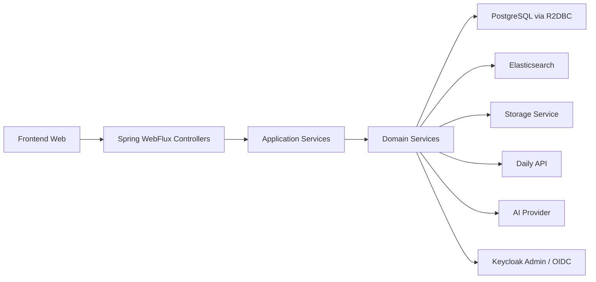
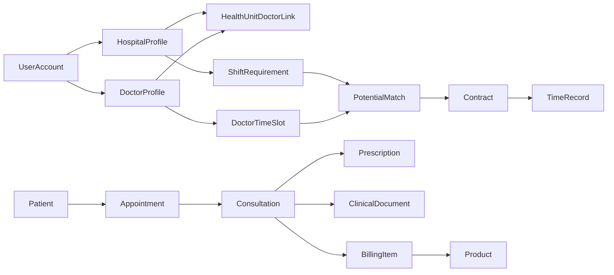
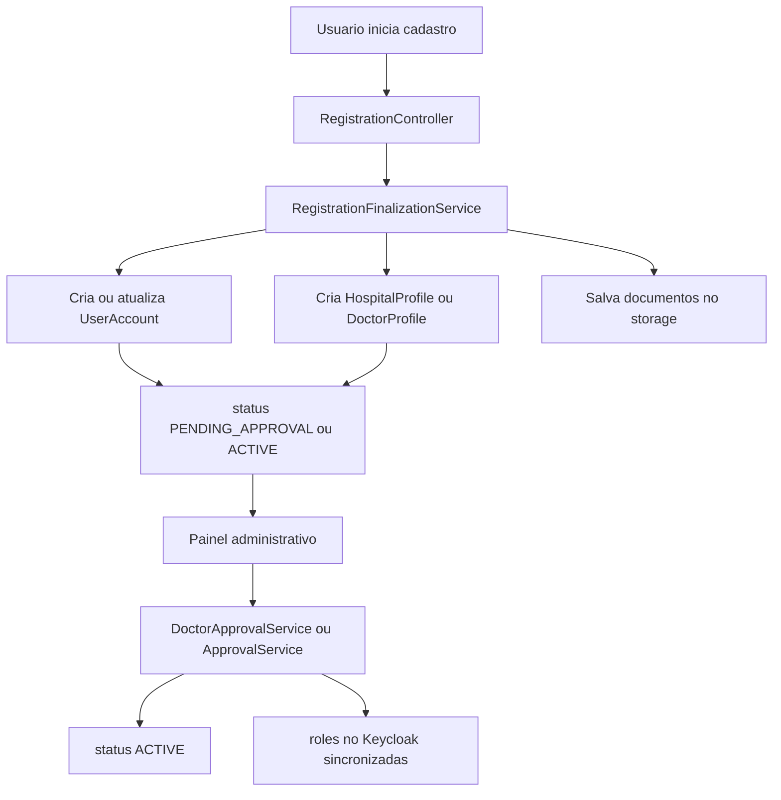
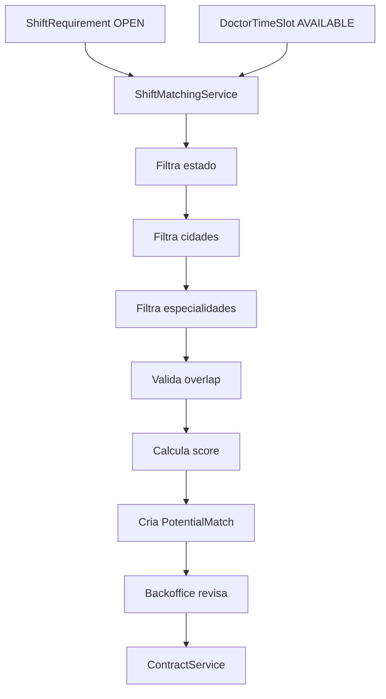
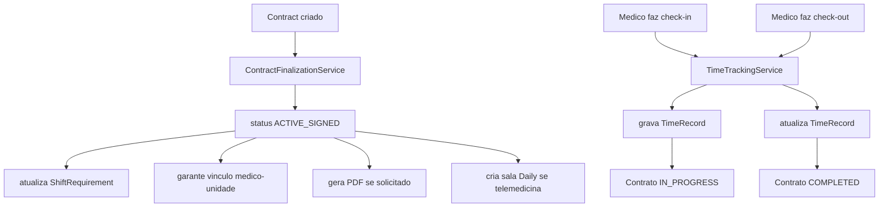
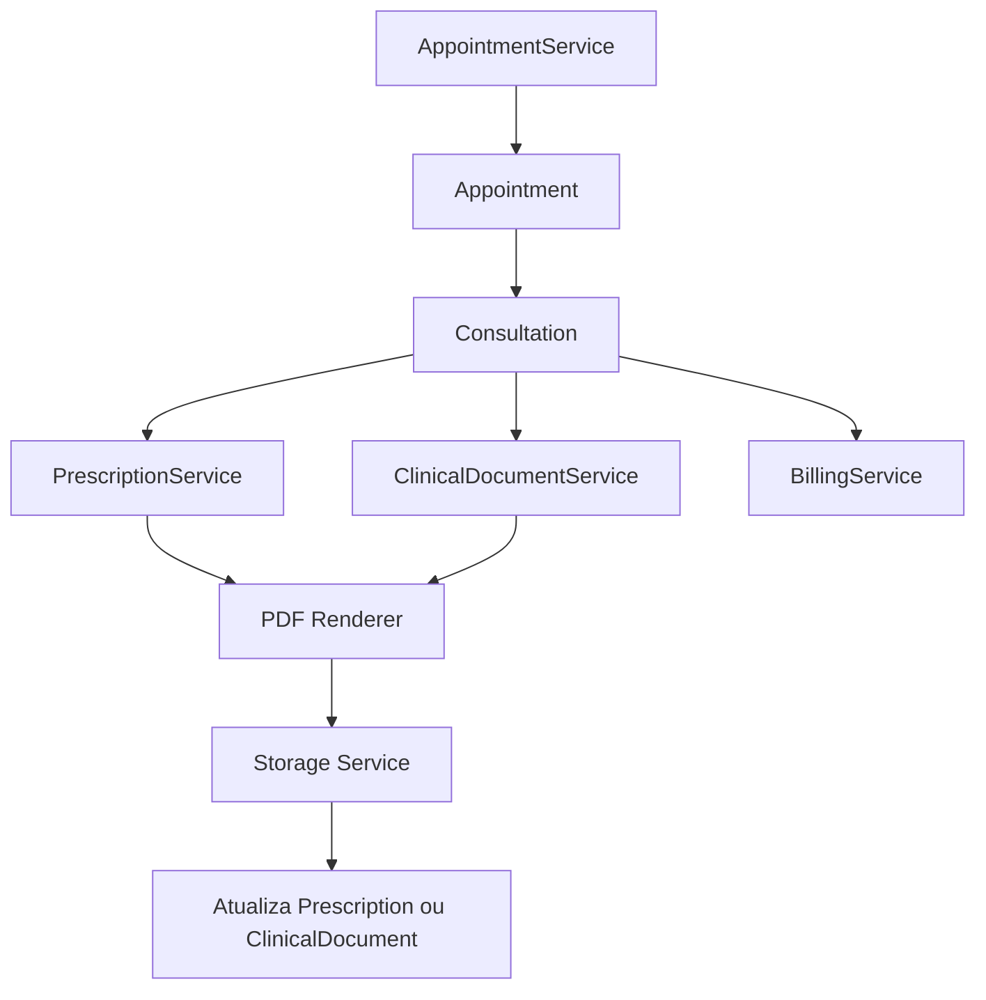
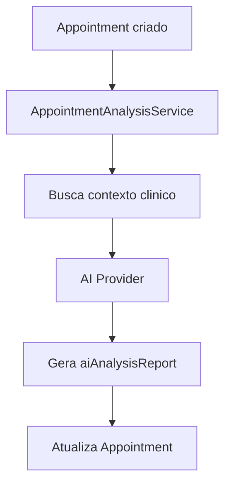

# Backend Java do Zero na Stack do Server

Este documento redefine o backend para ser construido do zero em Java, usando apenas a stack ja existente em `apps/server`.

Escopo desta versao:

- sem Firebase Auth;
- sem Firestore;
- sem Cloud Functions;
- sem Cloud Storage do Firebase;
- sem custom claims do Firebase;
- sem gatilhos nativos de documento.

Tudo passa a ser implementado no backend Java do `server`.

## Stack Alvo

Base tecnica ja existente no projeto:

- Java 21
- Spring Boot 3.5
- Spring WebFlux
- Spring Security OAuth2 Client + Resource Server
- Keycloak/OIDC
- R2DBC + PostgreSQL
- Elasticsearch
- Actuator + Prometheus
- OpenAPI com `springdoc`
- Docker Compose local

Integracoes externas permitidas:

- Keycloak para identidade e login
- armazenamento de arquivos via storage configurado pelo backend
- Daily API para telemedicina
- servico de IA via API HTTP futura

## Decisao Arquitetural

O `apps/server` sera a unica aplicacao de backend.

Isso implica:

- autenticacao feita pelo `server` via OIDC/Keycloak;
- autorizacao baseada em roles e regras internas no banco;
- persistencia principal em PostgreSQL;
- busca e indexacao em Elasticsearch quando necessario;
- eventos internos tratados dentro do proprio backend;
- arquivos geridos por um modulo de storage do proprio backend;

## Visao Geral



## Modelo de Seguranca

Autenticacao:

- login via Keycloak;
- tokens OIDC/JWT validados pelo `server`;
- sessao ou bearer token conforme o frontend consumir.

Autorizacao:

- roles aplicacionais no banco e refletidas no Keycloak;
- authorities do Spring Security;
- validacao de permissao por endpoint e por regra de dominio.

Roles alvo:

- `ROLE_ADMIN`
- `ROLE_HOSPITAL`
- `ROLE_DOCTOR`
- `ROLE_RECEPTIONIST`
- `ROLE_TRIAGE_NURSE`
- `ROLE_CARAVAN_ADMIN`

Status de usuario:

- `INVITED`
- `ACTIVE`
- `PENDING_APPROVAL`
- `SUSPENDED`

Status de verificacao documental:

- `PENDING_REVIEW`
- `APPROVED`
- `REJECTED`
- `NOT_APPLICABLE`

## Estrutura de Pacotes Proposta

```text
com.tws.company
  config
  security
  shared
  user
    domain
    repository
    service
    web
  hospital
  doctor
  invitation
  patient
  scheduling
  matching
  contract
  consultation
  appointment
  document
  billing
  timerecord
  product
  analysis
  maintenance
  integration
    keycloak
    daily
    storage
    ai
```

## Persistencia

Fonte principal de verdade:

- PostgreSQL

Busca:

- Elasticsearch

Arquivos:

- storage configurado pelo backend

Recomendacao:

- usar Postgres para todas as entidades transacionais e de dominio;
- usar Elasticsearch apenas para busca;
- nunca colocar regra de negocio primária fora do `server`.

## Entidades de Dominio

### `UserAccount`

Representa a identidade aplicacional.

Campos:

- `id`
- `keycloakUserId`
- `email`
- `displayName`
- `displayNameLowercase`
- `userType`
- `status`
- `documentVerificationStatus`
- `activated`
- `createdAt`
- `updatedAt`

### `HospitalProfile`

Campos:

- `id`
- `userId`
- `tradeName`
- `legalName`
- `cnpj`
- `stateRegistration`
- `phone`
- `address`
- `legalRepresentativeName`
- `legalRepresentativeCpf`
- `legalRepresentativeEmail`

### `DoctorProfile`

Campos:

- `id`
- `userId`
- `professionalCrm`
- `crmState`
- `specialties`
- `desiredHourlyRate`
- `approvalStatus`

### `HealthUnitDoctorLink`

Relacionamento hospital-medico.

Campos:

- `id`
- `hospitalId`
- `doctorId`
- `linkType`
- `createdAt`

### `Invitation`

Campos:

- `id`
- `hospitalId`
- `email`
- `token`
- `status`
- `expiresAt`
- `createdAt`

### `Patient`

Campos:

- `id`
- `cpf`
- `name`
- `birthDate`
- `phone`
- `email`
- `createdAt`
- `updatedAt`

### `ShiftRequirement`

Campos:

- `id`
- `hospitalId`
- `hospitalName`
- `dates`
- `startTime`
- `endTime`
- `isOvernight`
- `serviceType`
- `specialtiesRequired`
- `offeredRate`
- `numberOfVacancies`
- `status`
- `notes`
- `cities`
- `state`

### `DoctorTimeSlot`

Campos:

- `id`
- `doctorId`
- `doctorName`
- `date`
- `startTime`
- `endTime`
- `isOvernight`
- `serviceType`
- `specialties`
- `desiredHourlyRate`
- `status`
- `notes`
- `cities`
- `state`

### `PotentialMatch`

Campos:

- `id`
- `shiftRequirementId`
- `timeSlotId`
- `doctorId`
- `hospitalId`
- `matchedDate`
- `matchScore`
- `status`
- `offeredRateByHospital`
- `doctorDesiredRate`

### `Contract`

Campos:

- `id`
- `shiftRequirementId`
- `doctorId`
- `hospitalId`
- `doctorName`
- `hospitalName`
- `specialties`
- `shiftDates`
- `startTime`
- `endTime`
- `doctorRate`
- `serviceType`
- `status`
- `contractPdfPath`
- `telemedicineLink`

### `Appointment`

Campos:

- `id`
- `patientId`
- `patientName`
- `doctorId`
- `doctorName`
- `specialty`
- `type`
- `appointmentDate`
- `status`
- `telemedicineRoomUrl`
- `aiAnalysisReport`
- `createdBy`

### `Consultation`

Campos:

- `id`
- `appointmentId`
- `patientId`
- `doctorId`
- `telemedicineLink`
- `status`
- `totalMaterialCost`

### `Prescription`

Campos:

- `id`
- `consultationId`
- `patientName`
- `doctorName`
- `doctorCrm`
- `pdfPath`

### `ClinicalDocument`

Campos:

- `id`
- `consultationId`
- `type`
- `patientName`
- `doctorName`
- `doctorCrm`
- `details`
- `pdfPath`

### `TimeRecord`

Campos:

- `id`
- `contractId`
- `doctorId`
- `hospitalId`
- `checkInTime`
- `checkInLatitude`
- `checkInLongitude`
- `checkInPhotoPath`
- `checkOutTime`
- `checkOutLatitude`
- `checkOutLongitude`
- `checkOutPhotoPath`
- `status`

### `Product`

Campos:

- `id`
- `name`
- `costPerUnit`
- `status`

### `BillingItem`

Campos:

- `id`
- `consultationId`
- `productId`
- `productName`
- `quantityUsed`
- `unitCostAtTime`
- `totalCost`
- `recordedByUserId`

## Relacao Entre Entidades



## Mapeamento Completo dos Casos de Uso

### Identidade e Usuarios

| Caso de uso | Endpoint Java | Service |
| --- | --- | --- |
| criar staff | `POST /api/users/staff` | `UserProvisioningService` |
| criar medico | `POST /api/users/doctors` | `DoctorOnboardingService` |
| resetar senha de staff | `POST /api/users/staff/{id}/reset-password` | `StaffCredentialService` |
| resetar senha de medico | `POST /api/users/doctors/{id}/reset-password` | `DoctorCredentialService` |
| finalizar cadastro | `POST /api/registrations/finalize` | `RegistrationFinalizationService` |
| confirmar setup do usuario | `POST /api/users/me/confirm-setup` | `UserSetupService` |
| aprovar medico | `POST /api/admin/doctors/{id}/approve` | `DoctorApprovalService` |
| definir admin | `POST /api/admin/users/set-admin` | `RoleAdministrationService` |
| definir gestor hospitalar | `POST /api/admin/users/set-hospital-role` | `RoleAdministrationService` |
| convidar medico | `POST /api/hospitals/me/doctor-invitations` | `DoctorInvitationService` |
| associar medico a unidade | `POST /api/hospitals/me/doctors/{doctorId}` | `DoctorAssociationService` |
| buscar medicos vinculados | `POST /api/hospitals/me/doctors/search` | `DoctorSearchService` |

### Agenda e Telemedicina

| Caso de uso | Endpoint Java | Service |
| --- | --- | --- |
| criar agendamento | `POST /api/appointments` | `AppointmentService` |
| buscar horarios por especialidade | `POST /api/appointments/available-slots` | `AvailabilityQueryService` |
| buscar medico disponivel | `POST /api/appointments/available-doctor` | `DoctorAvailabilityService` |
| criar sala de consulta | `POST /api/consultations/{id}/telemedicine-room` | `ConsultationTelemedicineService` |
| criar sala de contrato | `POST /api/contracts/{id}/telemedicine-room` | `ContractTelemedicineService` |

### Matching e Contratos

| Caso de uso | Endpoint Java | Service |
| --- | --- | --- |
| criar demanda | `POST /api/shift-requirements` | `ShiftRequirementService` |
| criar disponibilidade | `POST /api/doctor-time-slots` | `DoctorTimeSlotService` |
| recalcular matches | `POST /api/matching/rebuild` | `ShiftMatchingService` |
| listar matches | `GET /api/potential-matches` | `PotentialMatchQueryService` |
| criar contrato | `POST /api/contracts` | `ContractService` |
| finalizar contrato | `POST /api/contracts/{id}/finalize` | `ContractFinalizationService` |

### Operacao e Faturamento

| Caso de uso | Endpoint Java | Service |
| --- | --- | --- |
| check-in | `POST /api/contracts/{id}/check-in` | `TimeTrackingService` |
| check-out | `POST /api/contracts/{id}/check-out` | `TimeTrackingService` |
| registrar item de faturamento | `POST /api/consultations/{id}/billing-items` | `BillingService` |

### Documentos Clinicos

| Caso de uso | Endpoint Java | Service |
| --- | --- | --- |
| gerar contrato em PDF | `POST /api/contracts/{id}/pdf` | `ContractDocumentService` |
| gerar receita | `POST /api/consultations/{id}/prescriptions` | `PrescriptionService` |
| gerar documento clinico | `POST /api/consultations/{id}/documents` | `ClinicalDocumentService` |

### IA e Scripts

| Caso de uso | Endpoint Java | Service |
| --- | --- | --- |
| rodar analise de IA no agendamento | `POST /api/appointments/{id}/analysis` | `AppointmentAnalysisService` |
| corrigir serviceType | `POST /api/scripts/service-type/correct` | `MaintenanceScriptService` |
| migrar perfis antigos de medico | `POST /api/scripts/migrate-doctor-profiles` | `DoctorProfileMigrationService` |
| migrar perfil de hospital | `POST /api/scripts/migrate-hospital-profile` | `HospitalProfileMigrationService` |

## Fluxo de Cadastro e Aprovacao



## Fluxo de Matching



## Fluxo de Contrato e Ponto



## Fluxo de Consulta e Documentos



## Fluxo de IA



## Eventos Internos no Lugar de Gatilhos

Como nao havera Firestore nem Cloud Functions, os gatilhos viram eventos internos da aplicacao.

Implementacao recomendada:

- publicar eventos de dominio dentro dos services;
- consumir eventos com listeners internos;
- usar fila interna ou outbox quando houver integracoes externas.

Eventos principais:

- `UserRegisteredEvent`
- `DoctorApprovedEvent`
- `DoctorLinkedToHospitalEvent`
- `ShiftRequirementOpenedEvent`
- `DoctorTimeSlotCreatedEvent`
- `ContractSignedEvent`
- `AppointmentCreatedEvent`
- `PrescriptionGeneratedEvent`
- `ClinicalDocumentGeneratedEvent`

## Integracoes Necessarias

### Keycloak

Responsabilidades:

- criar usuarios quando provisionados por admins;
- resetar senha;
- atribuir roles;
- sincronizar status de conta quando necessario.

Adaptador sugerido:

- `integration/keycloak/KeycloakAdminClient`

### Daily

Responsabilidades:

- criar salas de telemedicina para contrato e consulta.

Adaptador sugerido:

- `integration/daily/DailyRoomClient`

### Storage

Responsabilidades:

- salvar documentos de cadastro;
- salvar PDFs;
- salvar fotos de ponto.

Adaptador sugerido:

- `integration/storage/FileStorageService`

### IA

Responsabilidades:

- gerar pre-analise clinica;
- persistir retorno resumido no agendamento.

Adaptador sugerido:

- `integration/ai/ClinicalAnalysisClient`

## Ordem de Implementacao

1. modelar entidades e migrations no PostgreSQL;
2. modelar autenticacao/autorizacao com Keycloak e Spring Security;
3. implementar `UserAccount`, `HospitalProfile`, `DoctorProfile`, `Invitation` e `Patient`;
4. implementar agenda, disponibilidades e matching;
5. implementar contratos, ponto e faturamento;
6. implementar documentos clinicos e storage;
7. implementar IA e scripts administrativos;
8. indexar busca no Elasticsearch.

## Pontos de Atencao

- o legado em TypeScript misturava identidade, perfil e permissao no mesmo fluxo; no Java isso precisa ser separado;
- o matching deve ser idempotente e transacional;
- arquivos nao devem ser salvos como base64 no banco;
- roles de negocio devem existir no banco e na camada de seguranca;
- telemedicina, PDF e IA devem ficar atras de adaptadores;
- nao faz sentido reproduzir o modelo documental do Firebase dentro do Java.

## Resultado Esperado

Ao final, o `apps/server` concentra:

- autenticacao e autorizacao;
- dominio de negocio;
- integracoes externas;
- persistencia relacional;
- busca;
- eventos internos;
- documentos e arquivos;
- sem qualquer dependencia estrutural do Firebase.
